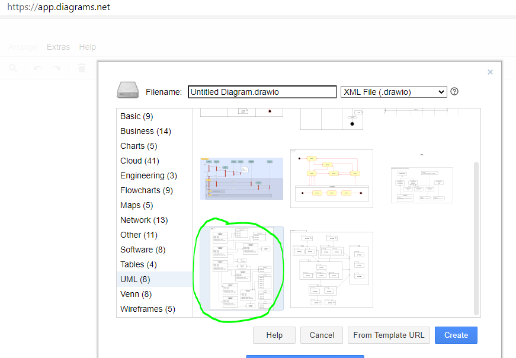

# Student Provided Design

This tables details the Roles & Responsibilities of the classes.

Class Name | Does | Has-A | Is-A
---------- | ---- | ----- | ----
TicTacToe | role placeholder | has placeholder | is placeholder   
DrawingPanel | role placeholder | has placeholder | is placeholder   
MenuDrawingPanel | role placeholder | has placeholder | is placeholder   
Board | role placeholder | has placeholder | is placeholder   
Move | role placeholder | has placeholder | is placeholder   


Here is a UML diagram for the class design. Update the diagram and/or link.
You should use: https://app.diagrams.net/ to create the diagram.


# TicTacToe Instructions

This project provides a simple template to do a graphical TicTacToe game.
It uses a slightly modified UW DrawingPanel.
Students should search the source code for "student" to read notes
specifically for them regarding what changes to make or not to make.

This README has a lot of helpful information on how to create
event handlers specific to this project.
<p>
The overall goal is to create a working, graphical game of
Tic Tac Toe while demonstrating good Object Oriented Design
and **using 4 different ways** to set an Event Handler.
<p>
The Student should use the TicTacToe class to drive the game forward.
All drawing should be delegated to the MenuDrawingPanel class.
Additional classes should be added to reduce the complexity of
it all as well as to **REUSE** code from prior work completed. 
For example, a Board class would be appropriate. <p>
Suggested Steps are:

0. Do Thread Play
1. Draw a TicTacToe board in the DrawingPane
2. Modify/add custom menu options to the Frame
3. Hook up event handler for custom menu
4. Hook up click event handler to receive user moves via click
5. Hook up KeyPressed event handler
6. Hook up mouse enter and mouse leave events
7. Add your design to the top of this Readme file

<p>
Each of the above steps should be verified before moving on. First make use of
the JOptionPane class or Debugger simply to verify that the events
are being triggered and the event handler is being called.
Then, add appropriate functionality to the game such as making a move
that is placed in the location that the user clicked. Or making a move
that represents the location typed in.

This project intends to exercise Event Handlers. There are four recommended ways
to hook up event handlers. Here they are from easiest to more elaborate:
1. Lambda Expression
2. Method pointer using Class::method, or this::method
3. Object that implements the interface
4. Anonymous inline class/interface

<p>
The easiest and best are Lambda Expressions and Method Pointers, but
these require that the design uses an interface that has ONLY a single
method. The interfaces in this project that have a single method are:

* DPMouseEventHandler - custom to DrawingPanel
* ActionListener
<p>

There are interfaces with multiple methods where more code is required.
* MouseListener
* KeyListener
<p>

The compiler does a bunch of tricks to allow the easier mechanisms to work.
It essentially creates an object that implements the interface in all cases.
A lambda expression is short-hand syntax to create an anonymous method that
is not really an object in and of itself. It is the implementation of the
only method in the interface. The compiler does some trickery to tie the
method implementation to an interface of some manufactured object.

## Thread Play
This section will guide the student through an exercise to help demonstrate
how threads work.

First, run the code without any changes. You'll notice that the drawing panel
is created using the default constructor. In the console you'll see:
```Main Thread is done!!```   
<p>How could this be? The program is still running?<p>
The answer is that when you create the drawing panel, another thread is
created and all execution continues on that thread. The main thread dies.
   Note that we will define a thread as follows:
```
   Definition of Thread: A path of execution with its own unique creation and termination. It remembers its own context. It may share instructions (code) with other threads. It may share variables/memory with other threads. There may be many threads in a single process.
```
Can we have the main thread stay alive and do more things while the other
thread is running? Yes, we can. And, often times we should! Before we go
too deeply, let's a few exercises that involve:

1. Have the main thread wait for some period of time
2. Setting up some menu items and event handlers
3. Have the main thread do stuff while waiting
4. Have the two threads talk to eachother

### Passive Wait
First: Let's have the main thread wait for a bit. We will do this by having it
go to sleep. In the go() method, call passiveWait(). This method will call:
    Thread.sleep(5000);
    
This will have the main thread sleep and stay alive for 5 seconds (5000 miliseconds).
Sometimes, sleeping for a bit is a great thing to do. Let's keep going to learn more.

### Add an Event Handler
Using the information found in this readme, add an menu item, "Passive wait." When
it is selected, have the thread wait for 30 seconds. As it is waiting, try selecting
a different menu item. What is happening??<p>
   
The thread that calls the event handler is the UI thread (the DrawingPanel thread).
When you have it wait, nothing can be drawn. Yuck!

### Active Waiting
Let's have the main thread wait until the UI thread triggers the main thread to die.
In the go() method, instead of calling passiveWait(), call activeWait().
Then, add another menu item, "Trigger" and create an event handler. When this
event handler gets called, set "isTriggered = true". 
The activeWait() method is actively counting forever until isTriggered. It moves
quite quickly. All this activity takes brainpower away from the UI Thread.

### Wait and Notify
The best way to have the main thread wait for another thread is to use the wait/notify
methods found on any object. In this case, we use the TicTacToe object, "this". In the
go() method, instead of calling activeWait(), have it call waitForNotify(). Then, in the
event handler for "Trigger", add or modify the code to have:
```
synchronized (this) {
    this.notify();
}
```         
This will cause the main thread to wait until it is notified. It is fast!

### Why all of this?
The reason we do this thread stuff is because UI will always require two threads. Doing
all the work on the UI thread causes bugs. If you ever choose to do serverside website work, creating
threads and working asynchronously is also extremely common.<p>
   
The last reason is because when we move to the next stage of Tic Tac Toe, you'll be
given a framework that does thread synchronization.<p>

In short... Because threads are cool! :-)

## Adding Menu Items
There is a method inside of MenuDrawingPanel that allows you to create extra
menu items to be added to the menu. See:
```
public JMenu getCustomMenu()
```
The method getCustomMenu() is called to get a JMenu that contains the menu items
you want to add to the menu. For each menu item, you need to set up an event handler.
For consistency, it is recommended that you follow the same model provided and
use the following to add the ActionListener:
```
item.addActionListener(e -> onItem(e));
```
This will result in the method onItem() inside of MenuDrawingPanel getting called, 
which simply forwards it to the ActionListener provided when constructing the
MenuDrawingPanel. So, in TicTacToe::go(), you'll have something like:
```
panel = new MenuDrawingPanel(600, 600, e -> onMenuItem(e));
```
Then, inside of the TicTacToe class, you can have a handler there:
```
private void onMenuItem(ActionEvent e) {
    String cmd = e.getActionCommand();
    if (cmd.equalsIgnoreCase("reset")) {
        reset();
    etc
```

## Keyboard Functionality
You can allow the user to type in a number/letter that represent a location
on the board. For example:
```
     A | B | C       1 | 2 | 3
     ---------       ---------
     D | E | F       4 | 5 | 6
     ---------       ---------
     G | H | I       7 | 8 | 9
```

## class TicTacToe
The TicTacToe class is the main driver of the TicTacToe game.
It will create an instance of itself and whatever other classes it needs.
<p>
   
Responsibilities:   
* Create supporting classes such as Board and MenuDrawingPanel
* Enforce the rules of TicTacToe with the help of the Board
* Keeps track of whose turn it is
* Sets up and handles click events from the user
* Pops up general game play UI dialog boxes

## class MenuDrawingPanel
Add methods to fulfill responsibilities.<p>
The STUDENT should add and implement methods to fulfill the Responsibilities
of this class. The methods will likely be called by the TicTacToe class which
drives the game forward and communicates between all the classes. The Student
should feel free to modify this class freely to attain the desired behavior.
Note that the constructor enables one to set up a ActionListener which is then
called in the onItem() method. 
<p>
 
Student Responsibilities Include:
* Draw TicTacToe lines
* Draw the X's and O's
* Add custom menu items to the Frame

<p>
To add custom menu items, add code to the method...

     public JMenu getCustomMenu()

You'll want to add more JMenuItems to the JMenu. Feel free to change the names
of the items and update the mnemonic to match correctly. For each menu item, you should retain:

     item.addActionListener(e -> onItem(e));

The above tells the application to call onItem(ActionEvent e) whenever an item is
selected by the user. Then, the method onItem() will call:

     this.listener.actionPerformed(e);

The above will call the event handler set in the constructor (if set).

## DrawingPanel
Make NO CHANGES to this file.<p>
Mr. Stride broke the rules and modified DrawingPanel by eliminating "final"
from the class declaration which prevented inheritance. By eliminating
"final" this MenuDrawingPanel can extend DrawingPanel. Added functionality
includes:
* ability to extend the class
* ability to insert custom menu items into the Frame

# Adding Event Handlers
There are many events and many ways to add event handlers to those events.
Some of the events are:
* Menu Item clicked
* Mouse clicked
* Mouse entered the application
* Mouse exited the application
* Key was typed

## Menu Item Clicked
You will want to first create an ActionListener. Then, pass in this action listener
into the constructor of the MenuDrawingPanel.

### 5 Ways to create an ActionListener
1. Create a separate class that implements ActionListener. Then, pass
in the reference to an instance of that object.
```
   this.myListener = new MyListener();
   panel = new MenuDrawingPanel(600, 600, this.myListener);
```

2. Have the TicTacToe class implement ActionListener directly. Then...
```
   panel = new MenuDrawingPanel(600, 600, this);
```

3. Create a method that has the same signature of the only method in ActionListener. Note that the interface definition is:
```
   interface ActionListener { public void actionPerformed(ActionEvent e); }
```

So, you'd create a method with the same signature, such as:<br>
```
   public void myHandler(ActionEvent e) {
```

Then you use the method pointer when create the MenuDrawingPanel.
```
   panel = new MenuDrawingPanel(600, 600, this::myHandler);
```

4. Use a lambda expression to represent your ActionListener. Your lambda could
handle everything right there, or it could just call some other method to do the work.

```
   panel = new MenuDrawingPanel(600, 600, (e) -> doWork(e); );
```

5. Create an inline, anonymous class that implements ActionListener. Your code would
look like this:

```
      panel = new MenuDrawingPanel(600, 600, new ActionListener() {
         @Override
         public void actionPerformed(ActionEvent e) {
            // do my event handling work here
         }
      });
```

### Ways to write a KeyListener
Since the KeyListener interface has multiple methods, your choices are a bit more
limited. From above, you can only use 1, 2 and 5:
1. Create a separate class
2. Have TicTacToe implement the interface
3. Method Pointers WILL NOT WORK!! Cannot use them here.
4. Lambda Expressions WILL NOT WORK!! Cannot use them here.
5. Create an inline, anonymous class

## Mouse Click Event Handler
There are two ways to get this done.
1. Call the onClick method and pass in an event handler of type: DPMouseEventHandler.
So, your code might look like this:

```
     panel.onClick( (x, y) -> myMethod(x, y) ); // method 1
     panel.onClick( this::myMethod );           // method 2
```

Of course, you could use the more verbose methods presented above. You can create a object, implement the interface directly, and use inline, anonymous classes. But, these are long and a bit ugly.

2. Add a mouse listener to the panel. This means that you'd have to create a MouseListener
interface implementation in the same way you might implement KeyListener mentioned above.
The code for doing an inline, anonymous class would look like this:
```
      panel.addMouseListener(new MouseListener() {
    	  @Override
    	  public void mouseEntered(MouseEvent e) {
    		  // do something
    	  }

    	  @Override
    	  public void mouseClicked(MouseEvent e) {
    		  System.out.println("Clicked!");
    	  }

    	  @Override
    	  public void mousePressed(MouseEvent e) {
    	  }

    	  @Override
    	  public void mouseReleased(MouseEvent e) {		
    	  }

    	  @Override
    	  public void mouseExited(MouseEvent e) {
    		  // do something
    	  }
      });
```
